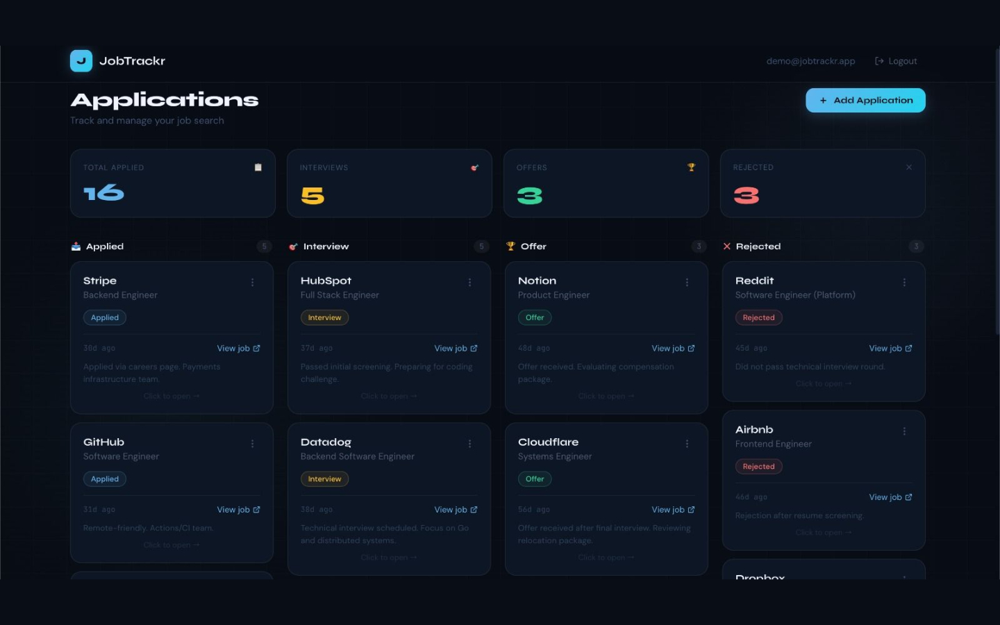
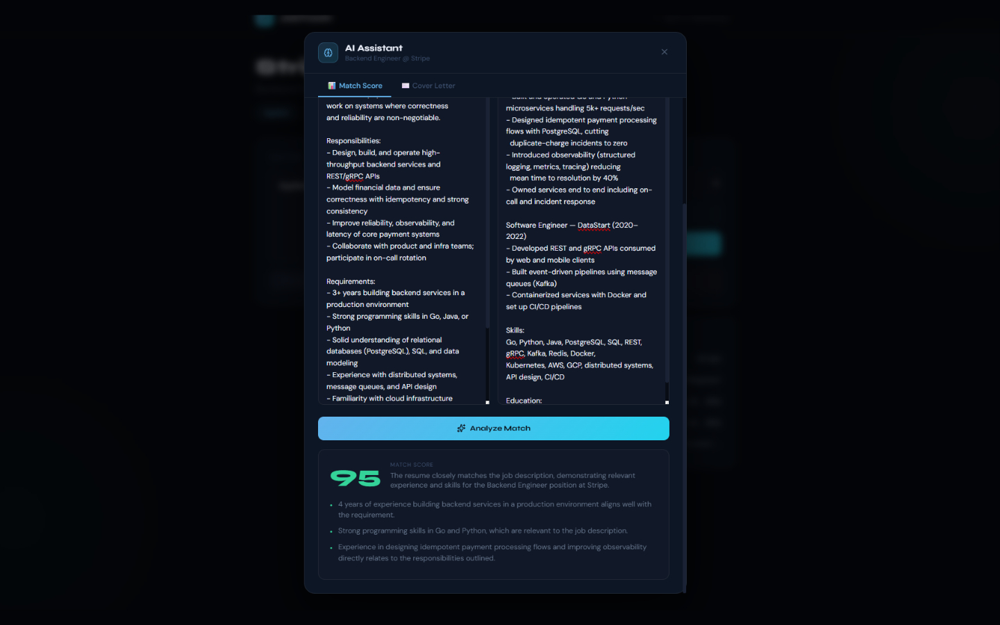
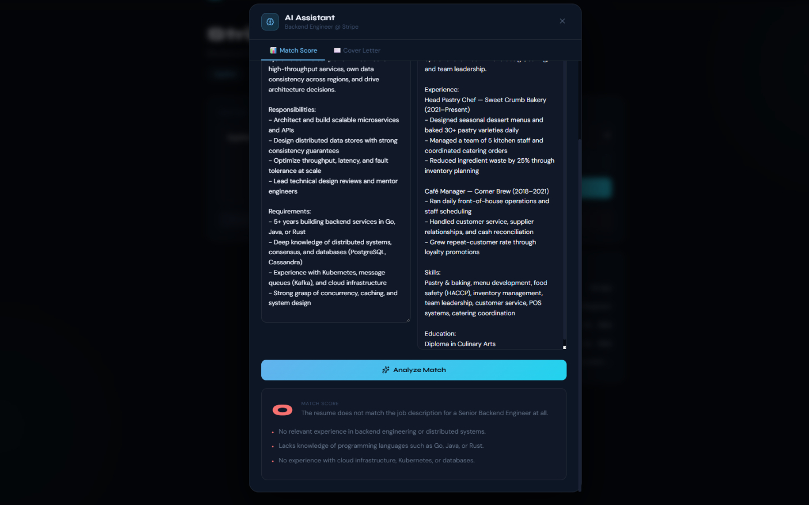

# JobTrackr

**AI-powered job application tracker — Kanban dashboard, resume match scoring, and AI cover-letter generation.**

[View Live Site](https://job-trackr-gamma-lilac.vercel.app/) · Backend repo: [jobTrackr-backend](https://github.com/ShoaibRana888/jobTrackr-backend)

| | |
|---|---|
| **Kanban dashboard** |  |
| **AI match score — strong match (95)** |  |
| **AI match score — no match (0)** |  |

## Overview

JobTrackr helps you manage a job search the way you'd manage a project: every application moves through a Kanban board (Applied → Interviewing → Offer → Rejected), each with its own detail page. Paste a job description alongside your resume and GPT-4o mini scores the match and gives feedback, or generates a tailored cover letter in seconds. All data is scoped per-user with Supabase row-level security, so each account only ever sees its own applications.

## Features

- Kanban-style dashboard for tracking applications by stage
- Per-application detail pages with notes and status history
- AI resume/job-description match scoring with feedback (GPT-4o mini)
- AI-generated, tailored cover letters
- Supabase authentication with row-level security (RLS) — every user's data is isolated at the database level

## Tech stack

- **Frontend:** Next.js 16, React 19, TypeScript, Tailwind CSS 4
- **Auth/DB client:** Supabase (`@supabase/ssr`, `@supabase/supabase-js`)
- **Icons:** lucide-react
- **Backend:** [jobTrackr-backend](https://github.com/ShoaibRana888/jobTrackr-backend) — FastAPI + OpenAI (see that repo for the API)

## Contact

**Shoaib Rana** — [shoaib.rana888@gmail.com](mailto:shoaib.rana888@gmail.com) · [Portfolio](https://portfolio-pied-two-34.vercel.app/) · [GitHub](https://github.com/ShoaibRana888)
